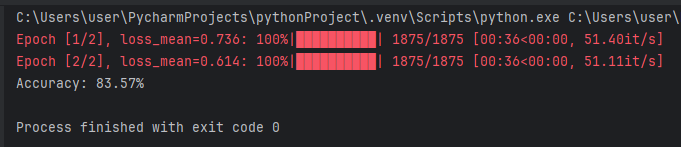
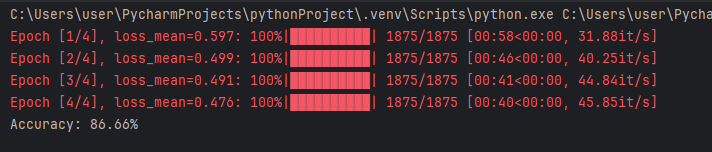
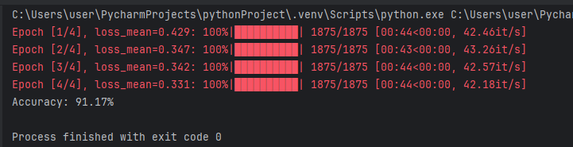
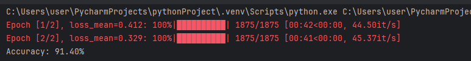

# Lab2. Num clasiffication neuro network

In this Lab i am not using matplotlib for visualization. Instead of - i am using tqdm (shell visualisation). This code tested on Intel i5 with no Nvidia grafic card
 
### First experiment
 * epochs = 2
 * hidden neuro layer = 32

Results:

### Second experiment

 * epochs = 4
 * hidden neuro layer = 32

### Third experiment

 * epochs = 4
 * hidden neuro layer = 64

 

 ### And the last one 

 * epochs = 2
 * hidden neuro layer = 64
 
 